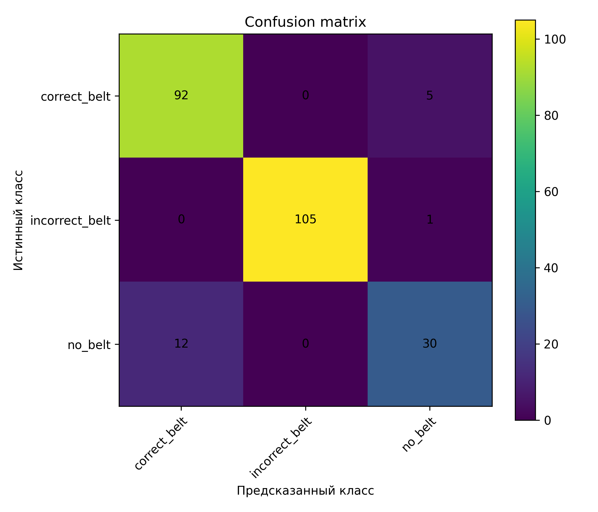

# Распознавание корректности использования ремня безопасности

Система компьютерного зрения для автоматического определения состояния
ремня безопасности водителя по изображению с внутрисалонной камеры.

Модель классифицирует изображение на три класса:

- `correct_belt` — ремень используется корректно;
- `incorrect_belt` — ремень используется некорректно;
- `no_belt` — ремень отсутствует.

В основе системы используется MobileNetV3 с transfer learning.

## 1. Постановка задачи

Штатные системы автомобиля способны определить факт защёлкивания
замка ремня безопасности, однако не позволяют оценить его фактическое
положение на теле водителя.

Цель проекта — разработать модель компьютерного зрения,
определяющую корректность использования ремня безопасности
по изображению водителя.

## 2. Датасет

Итоговый датасет содержит 1697 изображений:

| Класс | Количество |
|---|---:|
| `correct_belt` | 638 |
| `incorrect_belt` | 783 |
| `no_belt` | 276 |
| **Всего** | **1697** |

Данные были разделены на тренировочную, валидационную
и тестовую выборки:

| Выборка | Количество |
|---|---:|
| Train | 1204 |
| Validation | 248 |
| Test | 245 |

Изображения классов `correct_belt` и `no_belt` были получены
из открытых датасетов и вручную очищены.

Для класса `incorrect_belt` данные были собраны самостоятельно
из видеозаписей различных сценариев некорректного использования ремня.

При разделении самостоятельно собранных данных кадры одного
видеоролика не помещались одновременно в тренировочную и тестовую выборки.

## 3. Подготовка данных

Перед обучением изображения приводятся к размеру `224 × 224`.

Для тренировочной выборки применяются:

- RandomHorizontalFlip;
- изменение яркости;
- изменение контраста;
- изменение насыщенности;
- нормализация изображения.

Аугментация используется для повышения устойчивости модели
к изменению освещения и условий съёмки.

## 4. Модель

Использована архитектура **MobileNetV3**,
предобученная на ImageNet.

Для решения задачи применён transfer learning:
последний классификационный слой заменён на слой с тремя выходами.

Параметры обучения:

| Параметр | Значение |
|---|---:|
| Architecture | MobileNetV3 Small |
| Image size | 224 × 224 |
| Batch size | 16 |
| Epochs | 20 |
| Optimizer | Adam |
| Learning rate | 0.0001 |
| Loss | CrossEntropyLoss |

## 5. Метрики

Для оценки качества использовались:

- Accuracy;
- Balanced Accuracy;
- Precision;
- Recall;
- F1-score;
- ROC-AUC macro OVR;
- Confusion Matrix.

Дополнительно измерялись среднее время обработки одного
изображения и FPS.

## 6. Результаты

Итоговая трёхклассовая модель показала:

| Метрика | Значение |
|---|---:|
| Accuracy | **92.65%** |
| Balanced Accuracy | **88.44%** |
| ROC-AUC macro OVR | **0.9481** |
| Average inference time | **2.8 ms** |
| FPS | **354.41** |

### Результаты по классам

| Класс | Precision | Recall | F1-score |
|---|---:|---:|---:|
| `correct_belt` | 0.8846 | 0.9485 | 0.9154 |
| `incorrect_belt` | 1.0000 | 0.9906 | 0.9953 |
| `no_belt` | 0.8333 | 0.7143 | 0.7692 |

## 7. Матрица ошибок

Из 245 изображений тестовой выборки модель правильно
классифицировала 227.

Наиболее сложным оказался класс `no_belt`:
правильно распознано 30 изображений из 42.

## 8. Анализ ошибок

Анализ ошибочно классифицированных изображений показал несколько
типичных причин ошибок:

- сильная засветка изображения;
- тёмная одежда водителя;
- низкое качество изображения;
- необычный ракурс камеры;
- недостаточное количество примеров класса `no_belt`.

Примеры ошибочных предсказаний находятся в:

`results/prediction_examples/`

Дальнейшее улучшение модели связано прежде всего с расширением
и повышением разнообразия датасета.